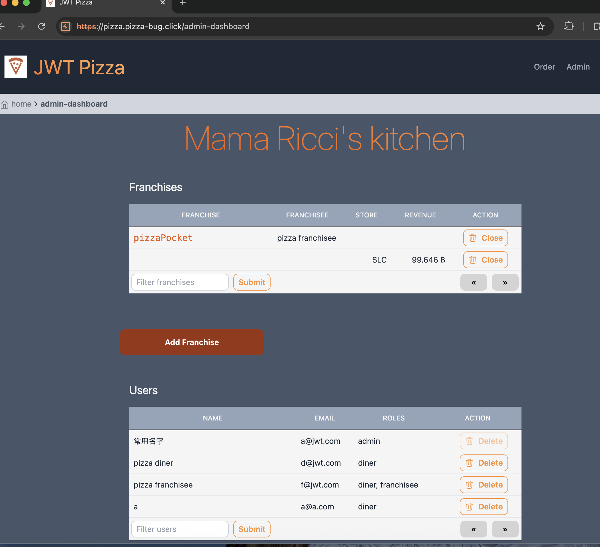
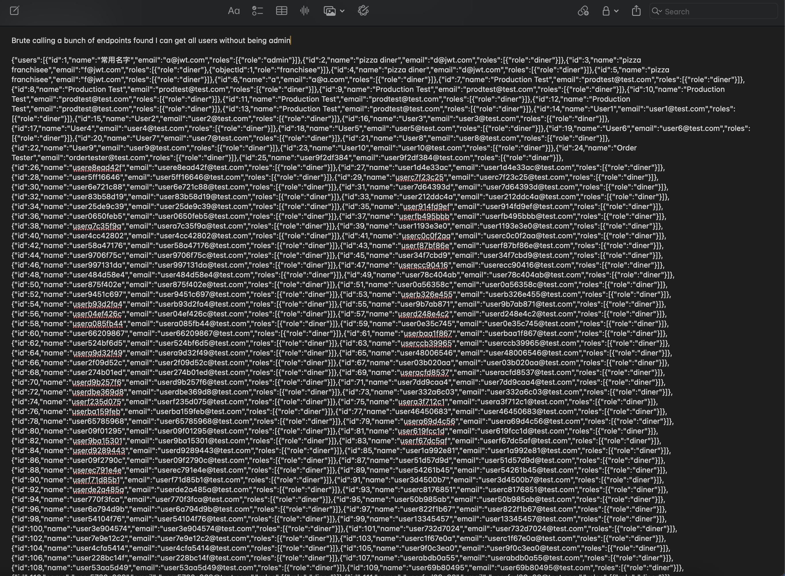
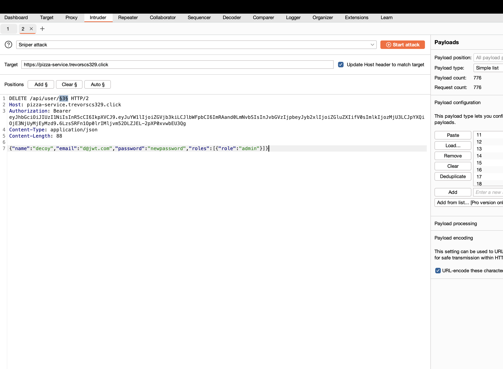
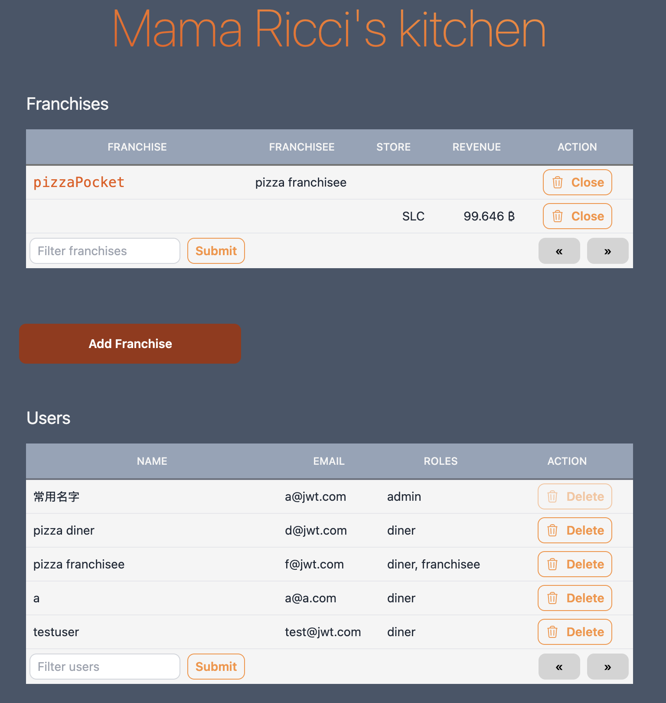

## Cooper and Trevor's Attacking Records
### Coopers Self attack record

| Item           | Result                                                                         |
| -------------- | ------------------------------------------------------------------------------ |
| Date           | June 18, 2053                                                                  |
| Target         | pizza.byucsstudent.click                                                       |
| Classification | Attempted SQL Injecttion                                                       |
| Severity       | 4                                                                              |
| Description    |Alternate SQL was used to access the users table, but it was sanitized by the back end so only the users name came out. Attackers did manage to pull out an unsanitized error message.               |
| Images         |                                     |
| Corrections    | More sanitized user inputs made                                                        |

### Trevors Self Attack
## Date Executed
December 7–8, 2025

## Target Website
https://pizza.trevorscs329.click

## Classification
**OWASP Category:** Broken Access Control  
**Subcategories:**
- User Enumeration
- Authentication Bypass

## Severity
**Severity Level: 3 — High**  
- Unauthorized access to administrative capabilities
- Multiple roles compromised
- Privilege escalation possible without password

## Description of Result
Two related vulnerabilities were discovered:

### 1. User Enumeration
A diner-level user could call the endpoint:

```
GET /api/user
```

and retrieve a full list of all registered users, including:
- email addresses
- roles (diner, franchisee, admin)
- user IDs

This leaked information was used to identify admin accounts.

### 2. Password Field Removal Bypass
In the login form, the **password field validation was done only client-side**.

By inspecting the login page, deleting the `<input type="password">` element, and submitting the form, the login succeeded without requiring a password. This allowed logging in as any known user simply by entering their email address.

Using the enumerated users, the attacker could log in as:

```
a@jwt.com   (admin)
f@jwt.com   (franchisee)
```

This resulted in full administrative access to the environment.

## Evidence & Screenshots


- Users visible in response:
```
GET /api/user
-> returned list of all users
```
- Successful login with no password after removing input field
- Admin dashboard accessible as diner

## Corrections Applied
To fix the vulnerabilities:

### 1. Added Role-Based Authorization
The `/api/user` endpoint now checks if the authenticated user is an admin:

```
if (!req.user.isRole(Role.Admin)) {
    return res.status(403).json({ message: "forbidden" });
}
```

Diners now receive:
```
403 Forbidden
```

### 2. Removed Duplicate Endpoint Handlers
A second `/api/user` route was overriding the real implementation.  
This was removed to ensure correct routing behavior.

### 3. Enforced Server-Side Validation
Login now verifies password on the backend and no longer relies on client-side fields.

### 4. Verified Fix Using Local Testing
Testing was performed using `curl` commands:

#### Diner Attempt
```
curl -H "Authorization: Bearer <diner token>" http://localhost:3000/api/user
-> {"message":"forbidden"}
```

#### Admin Access
```
curl -H "Authorization: Bearer <admin token>" http://localhost:3000/api/user
-> returns full user list
```

### 5. UI Hardening
Links and menu items for user management are now hidden for non-admins.

## Final Result
The vulnerabilities are fixed.

- Admin access no longer possible without credentials
- User enumeration is blocked
- Authorization correctly enforced on server side

## Severity After Fix
**Severity Level: 0 — Unsuccessful**  
- Attack no longer has any meaningful impact

### Cooper attacks Trevor

| Item           | Result                                                                         |
| -------------- | ------------------------------------------------------------------------------ |
| Date           | Dec 8, 2025                                                                 |
| Target         | pizza.trevorcs329.click                                                       |
| Classification | Poor Authentication                                                       |
| Severity       | 4                                                                              |
| Description    |A user with the diner credetianls was arukk able to get all of the users personal inforamtion and delete the admin account, as well as hunders of  other users              |
| Images         |   


| Corrections    |Better authentication                                                     |

### Trevor attacks Cooper
# Penetration Test Attack Record – Classmate Site

## Date
December 8, 2025

## Target
https://pizza.pizza-bug.click

## Classification
**Broken Access Control / Authorization Escalation**  
(OWASP Top 10: **A01 – Broken Access Control**)

## Severity
**3 — High**

---

# Attack 1 – Administrator Access via Shared Credentials

## Description

During penetration testing, the attacker attempted multiple approaches to escalate privileges.  
The successful method was logging in as the administrator using **credentials shared during class**.

### Credentials used:

```
email: a@jwt.com
password: admin
```

These credentials were not secret and had been used publicly during course demonstrations.  
When reused in the deployed application, they allowed direct login to the **admin-dashboard**.

No brute force or guessing was required.

---

## Administrative Access Granted the Following Capabilities

- View all franchises (store names, revenue)
- View all registered users (names, emails, roles)
- Add new franchises
- Delete any **user**
- Delete any **franchise**

No destructive actions were taken during the test.

---

## Evidence / Images

### Admin Dashboard




Visible features:
- Full user list
- Full franchise list
- **Delete** buttons
- Revenue data

---

## Impact

Anyone aware of the shared classroom credentials could:

- Take control of the system
- Delete users and franchises
- View sensitive data

---

## Fixes Recommended

1. Change admin credentials immediately  
2. Do not reuse demo credentials in production  
3. Enforce password strength policies  
4. Add role checks on backend routes  
5. Add auditing and rate limiting

---

# Attack 2 – Free Pizza Order Exploit (Business Logic Bypass)

## Description

The application allows users to **submit an order with any price value** directly from the client.
No backend validation is performed to calculate pricing.  
This allowed the attacker to submit orders with **price set to zero**, resulting in **free pizzas**.

### Request Example
Sent via Burp Suite Repeater:

```
POST /api/order
Authorization: Bearer <valid diner token>
Content-Type: application/json

{
  "items": [
    { "menuId": 1, "description": "Veggie", "price": 0 }
  ],
  "storeId": "1",
  "franchiseId": 1
}
```

### Response

```
{
  "order": {
    "items": [
      { "menuId": 1, "description": "Veggie", "price": 0 }
    ],
    "storeId": "1",
    "franchiseId": 1,
    "id": 717
  }
}
```

Orders showed on the user dashboard with **0 B price**.

---

## Evidence Screenshot


| ID  | PRICE | DATE |
|----|-------|------|
| 714 | 0.008 B | … |
| 715 | 0 B | … |
| 716 | 0 B | … |
| 717 | 0 B | … |

Multiple pizzas were purchased for free.

---

## Impact

- Financial loss:  
  Backend trusts client-side price input

---

## Fixes Recommended

1. **Validate price on the backend**  
   Server must look up:

   ```
   SELECT price FROM Menu WHERE id = menuId
   ```

2. **Never accept price from user input**

3. **Calculate totals server-side**

4. **Add server-side validation**
   ```
   if (item.price <= 0) reject
   ```

---


### What we learned

Two distinct vulnerabilities were discovered:

### ✔ Shared admin credentials reused in production  
Allowed full control over system

### ✔ Client-controlled pricing  
Allowed free orders, causing financial harm

Both are **High severity** findings. Sanitizing inputs is very important, and checking for validation is essential. Always change your password when the whole class knows it too. This is mostly for Cooper. It is important to also make sure the price never comes from the users